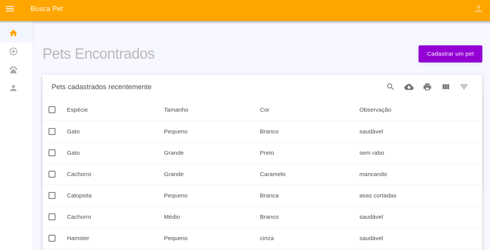
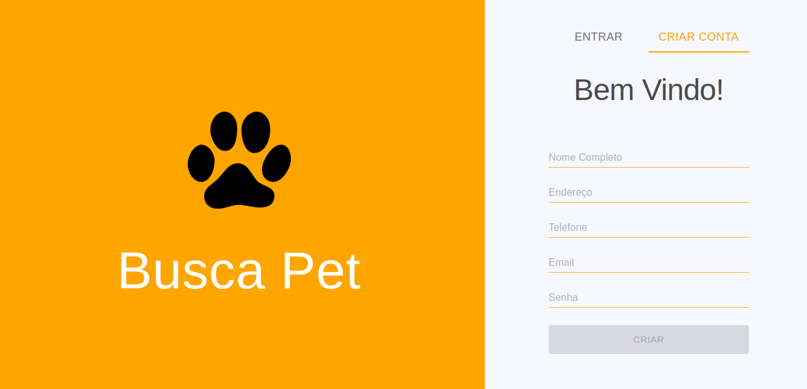
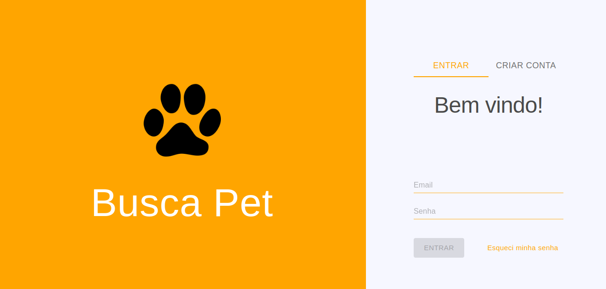
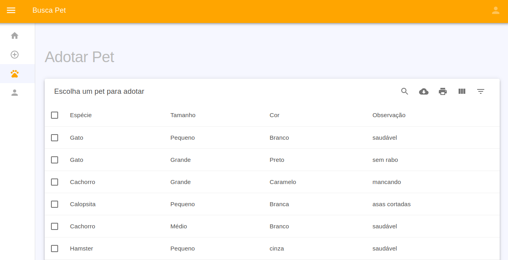
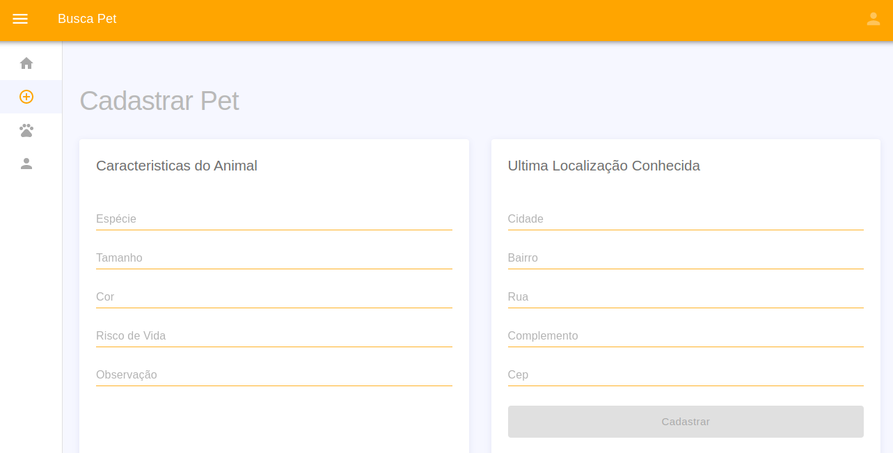

# Projeto de Interface

 Assim que o usuário entra na plataforma, ele é apresentado à tela inicial (Tela 1) onde é apresentado uma lista de animais encontrados recentemente.

 Tela 1 - Tela Inicial 

Caso ele demonstre interesse por algum dos animais listados ele deverá seguir para (Tela 2) onde é feito cadastro com seus dados pessoais. 

 Tela 2 - Tela Cadastro Usuário 

Na (Tela 3) o usuário poderá efetuar login para realizar sua identificação para adotar um pet.

 Tela 3 - Login Usuário 

Na (Tela 4) o usuário escolherá dentre os animais disponiveis qual melhor se encaixa em seu perfil para adoção.

 Tela 4 - Tela Adotar Pet 

Na (Tela 5) o usuário poderá cadastrar um pet avistado por ele, informando características básicas do animal bem como sua última localização conhecida.

 Tela 5 - Cadastrar Pet 

