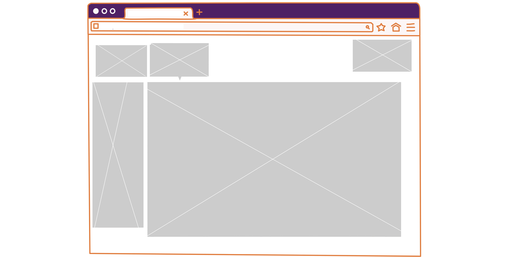

# Projeto de Interface

Na pagina original o usuario terá a visão do mapa da sua localidade marcando os casos de animais registrados e um aviso que é atualizado a cada novo registro. Terá botões para cadastrar usuario, buscar pet por caracteristicas, cadastrar animais, dicas para resgatar algum animal, reportar resgate de um animal e informações de ajuda.

Essa tela foi pensada para ser pratica e direta, na maior parte da tela o foco e no objetivo, mostrar os animais encontrados na região do usuario.

## Wireframes

São protótipos usados em design de interface para sugerir a estrutura de um site web e seu relacionamentos entre suas páginas. Um wireframe web é uma ilustração semelhante do layout de elementos fundamentais na interface.
