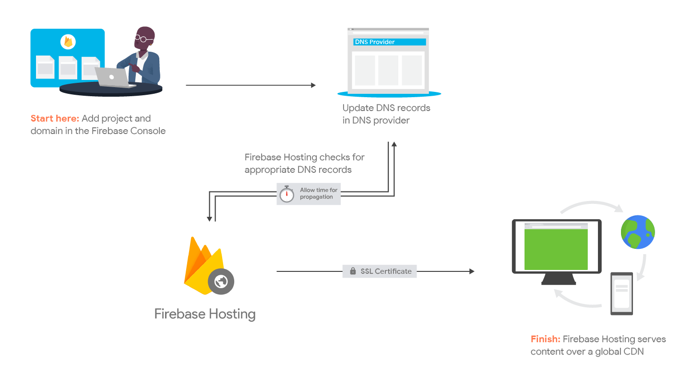

# Arquitetura da Solução

Pré-requisitos: <a href="3-Projeto de Interface.md"> Projeto de Interface</a>

# Diagrama de Componentes

Figura 1 - Hospedagem FireBase Hosting (imagens da documentação) 

A solução implementada conta com os seguintes módulos:
- **Navegador** - Interface básica do sistema  
  - **Páginas Web** - Conjunto de arquivos HTML, CSS, JavaScript e imagens que implementam as funcionalidades do sistema.
   - **Local Storage** - armazenamento mantido no Navegador, onde são implementados bancos de dados baseados em JSON. São eles: 
     - **Perfil de Usuário** - neste campo os interessados inserem seus dados cadastrais que permitem adotar ou informar um pet em situação de rua.
     - **Cadastrar Pet** - nesta seção é feito o cadastro dos animais encontrados em situação de rua. 
     - **Adotar Pet** - são ofertados animais em diversas situações de vunerabilidade.
     
 - **Hospedagem** - a aplicação ficará hospedada no FireBase.

## Hospedagem

Para esse projeto utilizamos a ferramenta do firebase que faz parte da GCP ( Google Cloud Plataform), ela torna simples a adoção do processo de deploy por todos os integrantes do time, também é possível com ela de maneira facilitada, monitorar e controlar versões dos artefatos entregues em produção.

Figura 2 - Hospedagem FireBase Hosting (imagens da documentação) 

